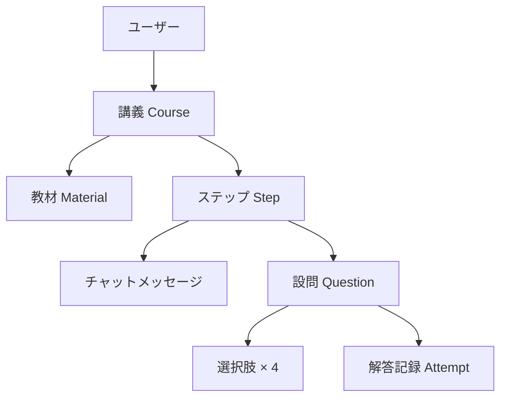
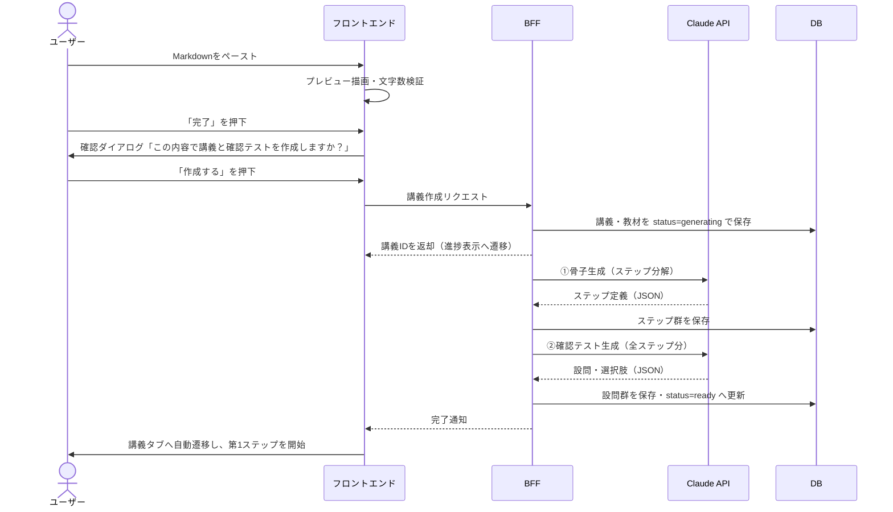
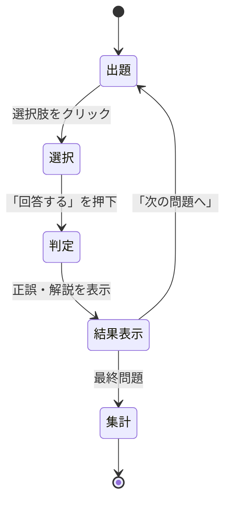
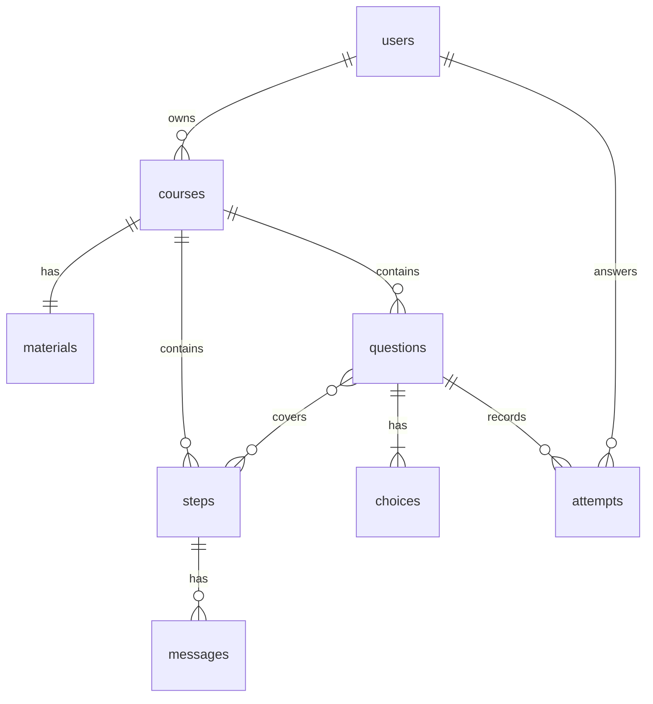
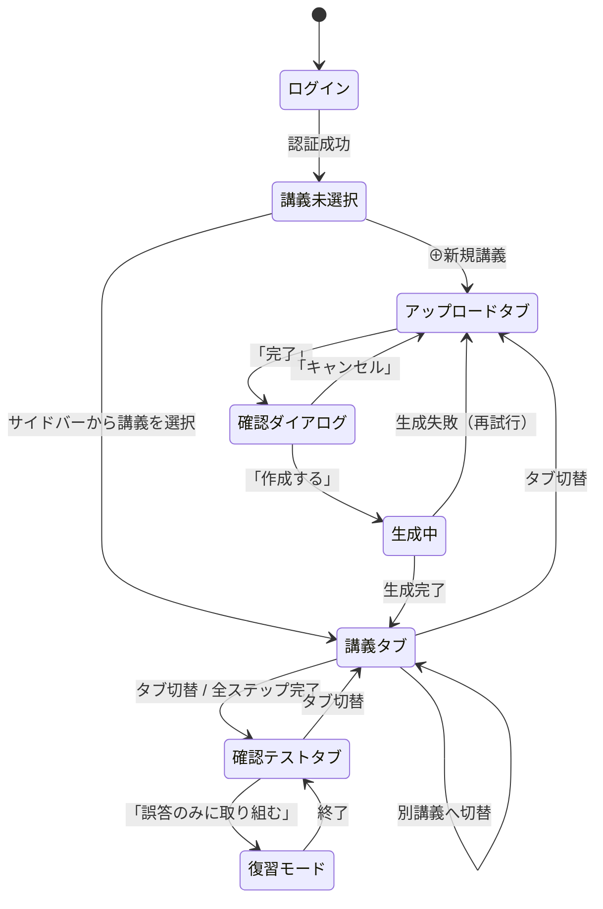

# AI講師 要件定義書

| 項目 | 内容 |
|---|---|
| プロダクト名 | AI講師（仮） |
| ドキュメント版数 | v0.1（初版） |
| 作成日 | 2026-08-26 |
| 作成者 | 平石悠生 |
| ステータス | ドラフト（技術選定は §7 で提案、未確定） |

---

## 1. 概要

### 1.1 目的

ユーザーが所有する参考書・講義資料（Markdown形式のテキスト）をアップロードすると、AIがその内容を学習に適したステップへ分解し、チャット形式の講義として順に解説する。各ステップの理解度は選択式の確認テストで測定し、誤答した問題のみを再挑戦できる。

「読む」だけで終わりがちな参考書を、「解説される → 質問できる → 測定される」という能動的な学習サイクルに変換することを目的とする。

### 1.2 解決する課題

| # | 課題 | 本プロダクトでの解決 |
|---|---|---|
| C-1 | 参考書は情報が線形に並んでおり、どこから何をどの順で学ぶべきかが自明でない | AIが依存関係を考慮してステップへ分解し、順序と学習目標を提示する（§4.1、§5.2） |
| C-2 | 読んでいる最中に生じた疑問を、その場で解消できない | 講義チャット内で随時質問でき、教材の該当箇所を根拠に回答する（§4.2.4） |
| C-3 | 読んだつもりでも定着したかを客観的に測れない | ステップ単位の4択確認テストで測定する（§4.3） |
| C-4 | 誤った箇所を後から効率的に復習できない | 正誤を永続化し、誤答問題のみを抽出した復習モードを提供する（§4.3.4） |
| C-5 | 現在どこまで進んだかを見失う | 講義中は進捗状況パネルで全ステップと現在地を常時表示する（§4.2.3） |

### 1.3 ターゲットユーザー

- 主：自習用の技術書・大学の講義資料を持ち、独学で進めている大学生・社会人
- MVPにおける想定利用者数：本人を含む数名（§1.5）

### 1.4 前提となる方針決定

本要件定義に先立ち、以下を確定した。

| 決定事項 | 選択 | 理由 |
|---|---|---|
| アーキテクチャ | BFF（サーバー側）＋ DB ＋ 認証 | Claude APIキーをブラウザに露出させないため。またワイヤーフレームがユーザーアカウント表示を含み、講義・進捗の永続化と端末間継続を前提としているため |
| スコープ | 個人利用のMVP | 不特定多数への公開に伴う課金・レート制限・法務要件を初版から抱え込まない。将来拡張は §11 に隔離 |
| 講義生成タイミング | 作成時に「骨子＋確認テスト」、講義本文は進行に合わせて逐次生成 | 初回待ち時間を短縮し、かつ未読ステップ分のトークン消費を避ける。同時に、確認テストは講義全体を俯瞰した状態で生成することで重複と網羅性の破綻を防ぐ |
| AI実行基盤 | **Claude API（Messages API）＋ APIキー**（Console の従量課金） | Claude Agent SDK ＋ Max プランの月額枠も検討したが、(1) 組み込みツールが既定で有効なため無効化を誤ると サーバー上でのファイル操作・コマンド実行を許してしまう、(2) 資格情報がアカウント全体のアクセス権を持ち支出上限を設定できない、(3) プロンプトキャッシュを明示制御できず消費量を見積もれない、(4) 常駐プロセスと永続ボリュームが必須になる、という理由で採用しない。詳細は §11.3 |
| 確認テストの選択肢数 | 4択 | 当初案の8択は誤答選択肢（ディストラクタ）を7つ生成する必要があり、埋め草的な選択肢が混入して実質的な難易度が下がるリスクが高いため、4択に変更した |

### 1.5 スコープ

**MVPに含む**

- Markdown教材のアップロードとプレビュー
- 講義（コース）の生成、一覧表示、切替
- チャット形式の講義進行、および質問応答
- 進捗状況の表示と永続化
- 4択確認テスト、正誤記録、誤答のみの復習モード
- 単一ユーザーを識別するための認証

**MVPに含まない**（§11 で扱う）

- PDF・画像・URLからの教材取り込み
- 記述式・穴埋め等、選択式以外の出題形式
- 講義内容の手動編集
- 他ユーザーとの講義共有、公開
- 課金、利用量制限、管理画面
- 学習履歴の統計ダッシュボード、忘却曲線に基づく復習スケジューリング

---

## 2. 用語定義

| 用語 | 定義 |
|---|---|
| **教材**（Material） | ユーザーがアップロードしたMarkdown原文。1つの講義に1つ紐づく |
| **講義**（Course） | 1つの教材から生成された学習単位。サイドバーの一覧に並ぶ要素（例：「Git入門」）。ステップ群と確認テストを内包する |
| **ステップ**（Step） | 講義を分解した学習単位。進捗状況パネルの各項目（例：「基本コマンド」「ブランチ」）に対応する。順序と学習目標を持つ |
| **骨子**（Outline） | 講義の全ステップ定義（タイトル・学習目標・要点・教材該当範囲）の集合。講義作成時に一括生成される |
| **講義本文**（Lecture Body） | 各ステップの解説メッセージ。ステップに到達した時点で生成される |
| **確認テスト**（Quiz） | ステップに紐づく4択問題の集合 |
| **設問**（Question） | 確認テストを構成する個々の問題。問題文・4つの選択肢・正解・解説から成る |
| **解答記録**（Attempt） | ユーザーが設問に回答した1回分の記録。選択した選択肢と正誤を持つ |
| **復習モード** | 過去に誤答した設問のみを抽出して出題するモード |

### 2.1 用語の階層関係



---

## 3. 画面構成

本章はワイヤーフレーム（`UIラフ.JPG`）を出発点に、**存在するすべての画面**を列挙する。実装時の認識のずれを避けることを目的とし、画面の抜けがないことを保証する。

### 3.1 画面一覧

| ID | 画面 | タブ | 進捗パネル | 入力欄 | 備考 |
|---|---|---|---|---|---|
| SC-01 | ログイン | — | — | — | 未認証時 |
| SC-02 | 空状態（講義0件） | 全タブ共通 | 非表示 | 非表示 | 初回ログイン直後 |
| SC-03 | アップロードタブ | アップロード | 非表示 | 非表示 | Markdown入力＋プレビュー |
| SC-04 | 作成確認ダイアログ | アップロード | 非表示 | 非表示 | 「完了」押下時 |
| SC-05 | 生成中 | 講義 | 非表示 | 非表示 | `status=generating` |
| SC-06 | 生成失敗 | 講義 | 非表示 | 非表示 | `status=failed` |
| SC-07 | 講義タブ | 講義 | **表示** | **表示** | 主画面 |
| SC-08 | 確認テスト／開始画面 | 確認テスト | 非表示 | 非表示 | 出題範囲の選択 |
| SC-09 | 確認テスト／出題中 | 確認テスト | 非表示 | 非表示 | 4択 |
| SC-10 | 確認テスト／正誤と解説 | 確認テスト | 非表示 | 非表示 | 都度フィードバック |
| SC-11 | 確認テスト／結果集計 | 確認テスト | 非表示 | 非表示 | 正答率・誤答一覧 |
| SC-12 | 復習モード／対象なし | 確認テスト | 非表示 | 非表示 | 誤答0件時 |
| SC-13 | 講義メニュー | — | — | — | サイドバーの `⋯` |
| SC-14 | 削除確認ダイアログ | — | — | — | 講義削除時 |
| SC-15 | ユーザーメニュー | — | — | — | ログアウト |
| SC-M01〜M05 | モバイル各画面 | — | — | — | §3.3 |

**復習モードの出題中・正誤表示・結果集計は、SC-09〜SC-11 と同一のレイアウトを用いる**（ヘッダーに「復習モード」と対象問数を表示する点のみが異なる）。そのため独立した画面としては数えない。

### 3.2 デスクトップの画面

幅1024px以上で適用する。以下の図は等幅フォントを前提とした模式図であり、寸法比率を規定するものではない。

**SC-01 ログイン画面（デスクトップ／モバイル共通）**

```
┌─────────────────────────────────────────────────────────────────────────────┐
│                                                                             │
│                                                                             │
│                                                                             │
│                                                                             │
│                                   AI 講師                                   │
│                                                                             │
│         参考書をアップロードすると、AIが講義と確認テストを作ります          │
│                                                                             │
│                                                                             │
│                      ┌──────────────────────────────┐                       │
│                      │ G   Googleでサインイン       │                       │
│                      └──────────────────────────────┘                       │
│                                                                             │
│                                                                             │
│                                                                             │
│                                                                             │
└─────────────────────────────────────────────────────────────────────────────┘
```

- 未認証時はこの画面のみを表示し、他の機能へは遷移できない（§4.5）
- サイドバー・タブバー・進捗パネルはいずれも表示しない
- 許可リストに含まれないアカウントでサインインした場合は、その旨を表示してサインアウトする

**SC-02 空状態（講義0件）**

```
┌────────────────────┬────────────────────────────────────────────────────────┐
│  AI講師            │  ┌─────────────────────────────────────────────────┐   │
│                    │  │   ⇧ アップロード  │[ 💬 講義 ]│  ☑ 確認テスト   │   │
│  ⊕ 新規講義        │  └─────────────────────────────────────────────────┘   │
│                    │                                                        │
│  まだありません    │                                                        │
│                    │                                                        │
│                    │                  まだ講義がありません                  │
│                    │                                                        │
│                    │       教材をアップロードすると講義が作成されます       │
│                    │                                                        │
│                    │             ┌────────────────────────────┐             │
│                    │             │ ⇧  教材をアップロード      │             │
│                    │             └────────────────────────────┘             │
│                    │                                                        │
│                    │                                                        │
│  ⊙ 平石悠生        │                                                        │
└────────────────────┴────────────────────────────────────────────────────────┘
```

- 初回ログイン直後の状態
- 講義タブ・確認テストタブを開いてもこの画面を表示する（§4.2.5）
- 進捗状況パネルは表示しない（対象となる講義がないため）

**SC-03 アップロードタブ**

```
┌────────────────────┬────────────────────────────────────────────────────────┐
│  AI講師            │  ┌─────────────────────────────────────────────────┐   │
│                    │  │ [ ⇧ アップロード ]│  💬 講義  │  ☑ 確認テスト   │   │
│  ⊕ 新規講義        │  └─────────────────────────────────────────────────┘   │
│                    │                                                        │
│  ▸ Git入門      ⋯  │ 講義タイトル（任意）                                   │
│    Reactハンズオン │ ┌──────────────────────────────────────────────────┐   │
│    VC期末対策      │ │ Git入門                                          │   │
│                    │ └──────────────────────────────────────────────────┘   │
│                    │                                                        │
│                    │ Markdown を貼り付け        プレビュー                  │
│                    │ ┌────────────────────────┐┌───────────────────────┐    │
│                    │ │ # Git入門              ││ Git入門               │    │
│                    │ │                        ││ ───────────           │    │
│                    │ │ ## 基本コマンド        ││ 基本コマンド          │    │
│                    │ │ `git init` は…         ││ git init は…          │    │
│                    │ │                        ││                       │    │
│                    │ └────────────────────────┘└───────────────────────┘    │
│                    │                                                        │
│                    │ 12,480 / 80,000 文字                                   │
│                    │                                         ┌────────────┐ │
│                    │                                         │    完了    │ │
│  ⊙ 平石悠生        │                                         └────────────┘ │
└────────────────────┴────────────────────────────────────────────────────────┘
```

- 左右2ペイン。左に Markdown 入力、右にリアルタイムプレビュー（§4.1.1）
- 文字数カウンタは現在値と上限を表示。500文字未満または80,000文字超で「完了」を非活性にする（§4.1.2）
- 数式・コードブロック・表をプレビューで描画する（§4.1.3）
- 進捗状況パネルと入力欄は表示しない

**SC-04 作成確認ダイアログ**

```
┌────────────────────┬────────────────────────────────────────────────────────┐
│  AI講師            │  ┌─────────────────────────────────────────────────┐   │
│                    │  │ [ ⇧ アップロード ]│  💬 講義  │  ☑ 確認テスト   │   │
│  ⊕ 新規講義        │  └─────────────────────────────────────────────────┘   │
│                    │                                                        │
│  ▸ Git入門      ⋯  │                                                        │
│    Reactハンズオン │      ┌──────────────────────────────────────────┐      │
│    VC期末対策      │      │                                          │      │
│                    │      │ この内容で講義と確認テストを             │      │
│                    │      │ 作成しますか？                           │      │
│                    │      │                                          │      │
│                    │      │ Git入門 ／ 12,480文字                    │      │
│                    │      │                                          │      │
│                    │      │   ┌────────────┐   ┌────────────┐        │      │
│                    │      │   │ キャンセル │   │  作成する  │        │      │
│                    │      │   └────────────┘   └────────────┘        │      │
│                    │      │                                          │      │
│                    │      └──────────────────────────────────────────┘      │
│                    │                                                        │
│  ⊙ 平石悠生        │                                                        │
└────────────────────┴────────────────────────────────────────────────────────┘
```

- 「完了」押下で表示する（§4.1.5）
- 「キャンセル」で入力内容を保持したままアップロードタブへ戻る
- 「作成する」で講義作成ジョブを起動し、SC-05 へ遷移する

**SC-05 生成中**

```
┌────────────────────┬────────────────────────────────────────────────────────┐
│  AI講師            │  ┌─────────────────────────────────────────────────┐   │
│                    │  │   ⇧ アップロード  │[ 💬 講義 ]│  ☑ 確認テスト   │   │
│  ⊕ 新規講義        │  └─────────────────────────────────────────────────┘   │
│                    │                                                        │
│  ▸ Git入門  生成中 │                                                        │
│    Reactハンズオン │                                                        │
│    VC期末対策      │              「Git入門」を作成しています               │
│                    │                                                        │
│                    │            ●━━━━━━━━━━━━━━●───────────────○            │
│                    │          ステップに分解      確認テストを作成          │
│                    │                                                        │
│                    │                 1〜2分程度かかります。                 │
│                    │           この画面を閉じても作成は続きます。           │
│                    │                                                        │
│  ⊙ 平石悠生        │                                                        │
└────────────────────┴────────────────────────────────────────────────────────┘
```

- 処理段階を2段階で表示する（§4.1.6、§7.4）
- サイドバーの当該講義には「生成中」を表示する（§4.4）
- 画面を離れてもジョブは継続する。再訪時は `status` に応じた画面を表示する
- フロントエンドは2秒間隔でポーリングする（§7.4）

**SC-06 生成失敗**

```
┌────────────────────┬────────────────────────────────────────────────────────┐
│  AI講師            │  ┌─────────────────────────────────────────────────┐   │
│                    │  │   ⇧ アップロード  │[ 💬 講義 ]│  ☑ 確認テスト   │   │
│  ⊕ 新規講義        │  └─────────────────────────────────────────────────┘   │
│                    │                                                        │
│  ▸ Git入門      ⋯  │                                                        │
│    Reactハンズオン │                                                        │
│    VC期末対策      │              ⚠  講義の作成に失敗しました               │
│                    │                                                        │
│                    │          教材の解析中にエラーが発生しました。          │
│                    │               （レート制限に達しました）               │
│                    │                                                        │
│                    │          ┌──────────────┐   ┌──────────────┐           │
│                    │          │  再試行する  │   │  講義を削除  │           │
│                    │          └──────────────┘   └──────────────┘           │
│                    │                                                        │
│  ⊙ 平石悠生        │                                                        │
└────────────────────┴────────────────────────────────────────────────────────┘
```

- `status=failed` の講義を選択したときに表示する
- エラー内容を提示する（§4.1.6、§5.7）
- 骨子生成のみ成功していた場合はこの画面ではなく講義タブを表示し、確認テストタブに再生成の導線を出す

**SC-07 講義タブ**

```
┌────────────────────┬────────────────────────────────────────────────────────┐
│  AI講師            │  ┌─────────────────────────────────────────────────┐   │
│                    │  │   ⇧ アップロード  │[ 💬 講義 ]│  ☑ 確認テスト   │   │
│  ⊕ 新規講義        │  └─────────────────────────────────────────────────┘   │
│                    │                                                        │
│  ▸ Git入門      ⋯  │ ● AI                               ┌─────────────────┐ │
│    Reactハンズオン │   ステップ1「基本コマンド」を      │ 進捗状況        │ │
│    VC期末対策      │   始めます。git init は…           │                 │ │
│                    │                                    │ ✓ 基本コマンド  │ │
│                    │                                    │ ✓ ブランチ      │ │
│                    │                                    │ ▸ コンフリクト  │ │
│                    │                                    │   リモート      │ │
│                    │                        平石 ●      │                 │ │
│                    │         なるほど、理解しました     │ 2 / 4 完了      │ │
│                    │                                    └─────────────────┘ │
│                    │ ● AI                                                   │
│                    │   では git add に進みます。                            │
│                    │   ここまでで質問はありますか？                         │
│                    │                                                        │
│                    │  ┌──────────────────────────────────────────────────┐  │
│                    │  │ プロンプトを入力                              ▷  │  │
│  ⊙ 平石悠生        │  └──────────────────────────────────────────────────┘  │
└────────────────────┴────────────────────────────────────────────────────────┘
```

- チャット形式で講義が進行する。AI応答はストリーミング表示（§4.2.1、§8.1）
- 右上に進捗状況パネル（C-1）。完了ステップに ✓、現在のステップに ▸ を表示（§4.2.3）
- 下部にプロンプト入力欄（E-1）。質問はここから送信する（§4.2.4）
- 完了済みステップをクリックすると、その時点の対話ログを読み取り専用で閲覧できる
- ステップ境界には区切りを表示する

**SC-08 確認テストタブ／開始画面**

```
┌────────────────────┬────────────────────────────────────────────────────────┐
│  AI講師            │  ┌─────────────────────────────────────────────────┐   │
│                    │  │   ⇧ アップロード  │  💬 講義  │[ ☑ 確認テスト ] │   │
│  ⊕ 新規講義        │  └─────────────────────────────────────────────────┘   │
│                    │                                                        │
│  ▸ Git入門      ⋯  │ 確認テスト  Git入門                                    │
│    Reactハンズオン │                                                        │
│    VC期末対策      │ ┌────────────────────────────────────────────────────┐ │
│                    │ │ 全24問から出題                                     │ │
│                    │ │ 正答率 75%（18 / 24）        ┌──────────────────┐  │ │
│                    │ │                              │  テストを始める  │  │ │
│                    │ │                              └──────────────────┘  │ │
│                    │ └────────────────────────────────────────────────────┘ │
│                    │                                                        │
│                    │ ステップで絞り込む（任意）                             │
│                    │   □ 基本コマンド   9問 / 正答率 89%                    │
│                    │   □ ブランチ       7問 / 正答率 71%                    │
│                    │   □ コンフリクト   5問 / 正答率 60%                    │
│                    │   □ リモート       3問 / 正答率 67%                    │
│                    │                                                        │
│                    │ ┌────────────────────────────┐                         │
│                    │ │ 誤答のみに取り組む（6問）  │                         │
│  ⊙ 平石悠生        │ └────────────────────────────┘                         │
└────────────────────┴────────────────────────────────────────────────────────┘
```

- **進捗状況パネルと入力欄は表示しない**（いずれも講義タブ専用。§3.4）
- 既定は講義全体からの出題。ステップによる絞り込みは任意（§4.3.1.1）
- 設問はステップに1対1で対応しないため、絞り込みの合計は総問数と一致しないことがある（横断設問が複数ステップに現れるため）
- 「誤答のみに取り組む」で復習モードへ入る（§4.3.4）

**SC-09 確認テストタブ／出題中**

```
┌────────────────────┬────────────────────────────────────────────────────────┐
│  AI講師            │  ┌─────────────────────────────────────────────────┐   │
│                    │  │   ⇧ アップロード  │  💬 講義  │[ ☑ 確認テスト ] │   │
│  ⊕ 新規講義        │  └─────────────────────────────────────────────────┘   │
│                    │                                                        │
│  ▸ Git入門      ⋯  │ 第3問 / 24問                    ━━━━━●──────────       │
│    Reactハンズオン │                                                        │
│    VC期末対策      │ ┌────────────────────────────────────────────────────┐ │
│                    │ │ git add と git commit の関係として正しいものは？   │ │
│                    │ └────────────────────────────────────────────────────┘ │
│                    │                                                        │
│                    │ ┌────────────────────────────────────────────────────┐ │
│                    │ │ A   add はステージに載せ、commit が履歴に記録する  │ │
│                    │ └────────────────────────────────────────────────────┘ │
│                    │ ┌────────────────────────────────────────────────────┐ │
│                    │ │ B   commit がステージに載せ、add が記録する        │ │
│                    │ └────────────────────────────────────────────────────┘ │
│                    │ ┌────────────────────────────────────────────────────┐ │
│                    │ │ C   add と commit はどちらも履歴を記録する         │ │
│                    │ └────────────────────────────────────────────────────┘ │
│                    │ ┌────────────────────────────────────────────────────┐ │
│                    │ │ D   add はリモートへ、commit はローカルへ送る      │ │
│                    │ └────────────────────────────────────────────────────┘ │
│                    │                                                        │
│                    │                                       ┌──────────────┐ │
│                    │                                       │   回答する   │ │
│  ⊙ 平石悠生        │                                       └──────────────┘ │
└────────────────────┴────────────────────────────────────────────────────────┘
```

- 4択・単一正答（§4.3.1）
- 選択肢は保存時にシャッフル済み。**出題順は受験のたびにシャッフルする**（Q-6）
- 選択肢をクリックして選び、「回答する」で確定する。確定後の変更は不可（§4.3.2）
- 選択肢の文体・長さ・粒度は揃える（§5.3 R-4）

**SC-10 確認テストタブ／正誤と解説**

```
┌────────────────────┬────────────────────────────────────────────────────────┐
│  AI講師            │  ┌─────────────────────────────────────────────────┐   │
│                    │  │   ⇧ アップロード  │  💬 講義  │[ ☑ 確認テスト ] │   │
│  ⊕ 新規講義        │  └─────────────────────────────────────────────────┘   │
│                    │                                                        │
│  ▸ Git入門      ⋯  │ 第3問 / 24問                    ━━━━━●──────────       │
│    Reactハンズオン │                                                        │
│    VC期末対策      │ ┌────────────────────────────────────────────────────┐ │
│                    │ │ git add と git commit の関係として正しいものは？   │ │
│                    │ └────────────────────────────────────────────────────┘ │
│                    │                                                        │
│                    │ ┌────────────────────────────────────────────────────┐ │
│                    │ │ ✓ A  add はステージに載せ、commit が記録    ← 正解 │ │
│                    │ └────────────────────────────────────────────────────┘ │
│                    │ ┌────────────────────────────────────────────────────┐ │
│                    │ │ ✗ B  commit がステージに載せ、add が記録    ← 選択 │ │
│                    │ └────────────────────────────────────────────────────┘ │
│                    │                                                        │
│                    │ ┌────────────────────────────────────────────────────┐ │
│                    │ │ 解説                                               │ │
│                    │ │ git add は変更をステージへ移す操作で、履歴に       │ │
│                    │ │ 記録するのは git commit です。…                    │ │
│                    │ └────────────────────────────────────────────────────┘ │
│                    │                                                        │
│                    │                                     ┌────────────────┐ │
│                    │                                     │  次の問題へ ▷  │ │
│  ⊙ 平石悠生        │                                     └────────────────┘ │
└────────────────────┴────────────────────────────────────────────────────────┘
```

- 1問ごとに即座に正誤と解説を表示する（都度フィードバック方式。§4.3.2）
- 正解の選択肢と、自分が選んだ選択肢の双方を明示する
- 解説は生成時に設問へ付与済み（§5.3 R-5）。ここで追加のAI呼び出しは行わない
- この時点で解答記録を1件追記する（§4.3.3）

**SC-11 確認テストタブ／結果集計**

```
┌────────────────────┬────────────────────────────────────────────────────────┐
│  AI講師            │  ┌─────────────────────────────────────────────────┐   │
│                    │  │   ⇧ アップロード  │  💬 講義  │[ ☑ 確認テスト ] │   │
│  ⊕ 新規講義        │  └─────────────────────────────────────────────────┘   │
│                    │                                                        │
│  ▸ Git入門      ⋯  │                                                        │
│    Reactハンズオン │                       テスト終了                       │
│    VC期末対策      │                                                        │
│                    │                 20 / 24 問 正解（83%）                 │
│                    │                                                        │
│                    │ 誤答した問題                                           │
│                    │   ✗ 第3問   git add と git commit の関係               │
│                    │   ✗ 第9問   detached HEAD の状態                       │
│                    │   ✗ 第15問  rebase と merge の履歴の違い               │
│                    │   ✗ 第22問  git fetch と git pull の差                 │
│                    │                                                        │
│                    │    ┌──────────────────────┐   ┌──────────────────┐     │
│                    │    │ 誤答のみ再挑戦（4問）│   │  講義タブへ戻る  │     │
│  ⊙ 平石悠生        │    └──────────────────────┘   └──────────────────┘     │
└────────────────────┴────────────────────────────────────────────────────────┘
```

- 正答率、誤答一覧、復習モードへの導線を表示する（§4.3.2）
- 誤答項目をクリックすると当該設問の解説を再表示する

**SC-12 復習モード／対象なし**

```
┌────────────────────┬────────────────────────────────────────────────────────┐
│  AI講師            │  ┌─────────────────────────────────────────────────┐   │
│                    │  │   ⇧ アップロード  │  💬 講義  │[ ☑ 確認テスト ] │   │
│  ⊕ 新規講義        │  └─────────────────────────────────────────────────┘   │
│                    │                                                        │
│  ▸ Git入門      ⋯  │                                                        │
│    Reactハンズオン │                                                        │
│    VC期末対策      │                誤答した問題はありません                │
│                    │                                                        │
│                    │             すべての設問に正解しています。             │
│                    │                                                        │
│                    │               ┌────────────────────────┐               │
│                    │               │ 通常のテストに戻る     │               │
│                    │               └────────────────────────┘               │
│                    │                                                        │
│                    │                                                        │
│  ⊙ 平石悠生        │                                                        │
└────────────────────┴────────────────────────────────────────────────────────┘
```

- 最新の解答記録が誤答である設問が0件のときに表示する（§4.3.4）

### 3.3 モバイルの画面

**モバイル対応はMVPに含める（Q-1）。**

| ブレークポイント | 呼称 | 方針 |
|---|---|---|
| 1024px以上 | デスクトップ | §3.2 のレイアウトを適用 |
| 768〜1023px | タブレット | サイドバーをドロワーへ格納。それ以外はデスクトップに準じる |
| 767px以下 | モバイル | 下表のとおり再構成する |

**モバイル時の再構成**

| 領域 | モバイルでの扱い |
|---|---|
| サイドバー（A-1〜A-4） | ハンバーガーメニューからのドロワー（SC-M03）。講義選択後は自動的に閉じる |
| タブ切替（B-1） | **画面下部に固定したタブバー**へ移動する。上部固定では親指が届かず、モバイルの標準的な操作と乖離するため |
| 進捗状況パネル（C-1） | 講義タブのヘッダー下に1行で折りたたみ表示し、タップで全ステップ一覧を展開する（SC-M01 / SC-M02） |
| プロンプト入力欄（E-1） | 画面下部に固定。ソフトキーボード表示時は Visual Viewport API で入力欄が隠れないよう追従させる |
| アップロードタブの2ペイン | 左右分割をやめ、「入力」「プレビュー」のトグル切替とする（SC-M04） |
| コードブロック・数式・表 | 横スクロール可能なコンテナに収め、ページ全体が横スクロールしないようにする |
| 確認テストの選択肢 | 縦積みの全幅ボタンとし、タップ領域を44px以上確保する（SC-M05） |

**下部の競合（Q-15 の決定）**

講義タブでは、タブバー（B-1）とプロンプト入力欄（E-1）がいずれも画面下部を占める。ソフトキーボード表示時の可視領域は400px程度で、ヘッダー56px・進捗折りたたみ行40px・入力欄56px・タブバー56px を差し引くとチャットに残るのは約190px（3〜4行）となり、解説を読みながら質問するという講義タブの使い方が成立しない。

**キーボード表示中はタブバーを隠す（確定）。**

| 項目 | 仕様 |
|---|---|
| 条件 | プロンプト入力欄がフォーカスされ、ソフトキーボードが表示されている間 |
| 挙動 | タブバーを非表示にし、入力欄を画面下端へ寄せる。キーボードが閉じたらタブバーを復帰させる |
| 検知 | Visual Viewport API（入力欄の追従に用いるものと同一） |
| 根拠 | 文字入力中にタブを切り替える操作は実質発生しない。またスクロール方向で出し入れする方式（下方向スクロールで隠す等）は、講義タブが上へ遡って読み返す操作を多く含むため、意図しない出入りが起きて煩わしい |

タブバーの表示状態は「ソフトキーボードの有無」のみで決まる。それ以外の要因（スクロール方向、経過時間など）で出し入れしない。

以下に、デスクトップと構造が異なる画面を示す。ここに挙げていない画面（SC-01・SC-02・SC-04〜SC-06・SC-08・SC-10〜SC-12）は、上表の再構成規則をそのまま適用したものとなり、構造上の差異が生じない。

**SC-M01 講義タブ（進捗パネル折りたたみ）**

```
┌──────────────────────────────────────┐
│ ☰   AI講師                       ⊙   │
├──────────────────────────────────────┤
│ Git入門            2 / 4 完了  ▾     │
├──────────────────────────────────────┤
│ ● AI                                 │
│   ステップ1「基本コマンド」を        │
│   始めます。git init は…             │
│                                      │
│                       平石 ●         │
│        なるほど、理解しました        │
│                                      │
│ ● AI                                 │
│   では git add に進みます。          │
│                                      │
├──────────────────────────────────────┤
│  ┌────────────────────────────────┐  │
│  │ プロンプトを入力          ▷    │  │
│  └────────────────────────────────┘  │
├──────────────────────────────────────┤
│  ⇧ 教材  │ [💬 講義] │  ☑ テスト     │
└──────────────────────────────────────┘
```

- **タブバーは画面下部に固定**する。上部固定では親指が届かないため（§3.3）
- 進捗状況パネルはヘッダー下の1行に折りたたむ。`▾` をタップで SC-M02 へ展開する
- プロンプト入力欄は下部固定。ソフトキーボード表示時は Visual Viewport API で追従させる

**SC-M02 講義タブ（進捗パネル展開）**

```
┌──────────────────────────────────────┐
│ ☰   AI講師                       ⊙   │
├──────────────────────────────────────┤
│ Git入門            2 / 4 完了  ▴     │
│ ┌──────────────────────────────────┐ │
│ │ ✓ 基本コマンド                   │ │
│ │ ✓ ブランチ                       │ │
│ │ ▸ コンフリクト                   │ │
│ │   リモート                       │ │
│ └──────────────────────────────────┘ │
├──────────────────────────────────────┤
│ ● AI                                 │
│   ステップ1「基本コマンド」を        │
│   始めます。git init は…             │
│                                      │
├──────────────────────────────────────┤
│  ┌────────────────────────────────┐  │
│  │ プロンプトを入力          ▷    │  │
│  └────────────────────────────────┘  │
├──────────────────────────────────────┤
│  ⇧ 教材  │ [💬 講義] │  ☑ テスト     │
└──────────────────────────────────────┘
```

- 折りたたみ行をタップすると全ステップ一覧を展開する
- 展開中もチャットは背後に残り、再度タップで閉じる

**SC-M03 サイドバー（ドロワー）**

```
┌──────────────────────────────────────┐
│ ✕                                    │
│                                      │
│  AI講師                              │
│                                      │
│  ⊕ 新規講義                          │
│                                      │
│  ▸ Git入門                     ⋯     │
│    Reactハンズオン             ⋯     │
│    VC期末対策                  ⋯     │
│                                      │
│                                      │
│                                      │
│                                      │
├──────────────────────────────────────┤
│  ⊙ 平石悠生                          │
└──────────────────────────────────────┘
```

- ヘッダーの ☰ をタップで左から表示する（§3.3）
- 講義を選択すると自動的に閉じ、講義タブへ切り替わる（§4.4）
- 各行の `⋯` から SC-13（リネーム／削除）を開く

**SC-M04 アップロードタブ**

```
┌──────────────────────────────────────┐
│ ☰   AI講師                       ⊙   │
├──────────────────────────────────────┤
│ 講義タイトル（任意）                 │
│ ┌──────────────────────────────────┐ │
│ │ Git入門                          │ │
│ └──────────────────────────────────┘ │
│                                      │
│  [ 入力 ]  │   プレビュー            │
│ ┌──────────────────────────────────┐ │
│ │ # Git入門                        │ │
│ │                                  │ │
│ │ ## 基本コマンド                  │ │
│ │ `git init` は…                   │ │
│ └──────────────────────────────────┘ │
│ 12,480 / 80,000 文字                 │
│                                      │
│                       ┌────────────┐ │
│                       │    完了    │ │
│                       └────────────┘ │
├──────────────────────────────────────┤
│ [⇧ 教材] │  💬 講義  │  ☑ テスト     │
└──────────────────────────────────────┘
```

- **左右2ペインをやめ、「入力／プレビュー」のトグル切替**にする（§3.3）
- 進捗パネルとプロンプト入力欄は表示しない

**SC-M05 確認テストタブ（出題中）**

```
┌──────────────────────────────────────┐
│ ☰   AI講師                       ⊙   │
├──────────────────────────────────────┤
│ 第3問 / 24問        ━━━━●───────     │
├──────────────────────────────────────┤
│ git add と git commit の関係と       │
│ して正しいものは？                   │
│                                      │
│ ┌──────────────────────────────────┐ │
│ │ A  add はステージに載せ、        │ │
│ │    commit が履歴に記録する       │ │
│ └──────────────────────────────────┘ │
│ ┌──────────────────────────────────┐ │
│ │ B  commit がステージに載せ、     │ │
│ │    add が記録する                │ │
│ └──────────────────────────────────┘ │
│            （C・D は下にスクロール） │
│                                      │
│      ┌────────────────────────┐      │
│      │        回答する        │      │
│      └────────────────────────┘      │
├──────────────────────────────────────┤
│  ⇧ 教材  │  💬 講義  │ [☑ テスト]    │
└──────────────────────────────────────┘
```

- 選択肢は縦積みの全幅ボタン。**タップ領域を44px以上確保する**（§3.3）
- 選択肢の文字数によっては折り返す。長い選択肢でも全文を表示し、省略しない
- 進捗パネルと入力欄は表示しない

### 3.4 共通領域の仕様

| ID | 領域 | 内容 | 表示条件 |
|---|---|---|---|
| **A-1** | サイドバー最上部 | アプリ名「AI講師」 | 常時（モバイルはドロワー内） |
| **A-2** | サイドバー | 「⊕ 新規講義」ボタン。押下でアップロードタブを空状態で開く | 常時 |
| **A-3** | サイドバー | 講義一覧。更新日時の降順。クリックで当該講義を選択状態にする。選択中の講義はハイライトする | 常時（0件時は空状態メッセージ） |
| **A-4** | サイドバー最下部 | ユーザーアイコンとユーザー名。クリックで SC-15 を表示 | ログイン時のみ |
| **B-1** | タブ切替 | アップロード／講義／確認テスト | 常時（デスクトップは上部中央、モバイルは下部固定） |
| **C-1** | 進捗状況パネル | ステップ一覧と完了状態を表示 | **講義タブを開いている場合のみ**。アップロードタブ・確認テストタブでは表示しない |
| **D-1** | メイン領域 | タブに応じたコンテンツ | 常時 |
| **E-1** | プロンプト入力欄 | 質問・応答の入力 | 講義タブでのみ表示 |

### 3.5 ダイアログ・メニュー

**SC-13 講義メニュー**

```
  ▸ Git入門      ⋯
                  └─┐
        ┌───────────────────────┐
        │  名前を変更           │
        │  削除                 │
        └───────────────────────┘
```

- サイドバーの各講義の `⋯` から開く（§4.4）
- 「名前を変更」はその場で編集可能にする
- 「削除」は SC-14 を表示する

**SC-14 削除確認ダイアログ**

```
┌────────────────────────────────────────────┐
│                                            │
│ 「Git入門」を削除しますか？                │
│                                            │
│ 講義・対話ログ・確認テスト・解答記録が     │
│ すべて削除されます。元に戻せません。       │
│                                            │
│    ┌────────────┐   ┌────────────┐         │
│    │ キャンセル │   │   削除する │         │
│    └────────────┘   └────────────┘         │
│                                            │
└────────────────────────────────────────────┘
```

- 関連するステップ・メッセージ・設問・解答記録をすべて削除する（§4.4）
- 復元手段は用意しない

**SC-15 ユーザーメニュー**

```
        ┌───────────────────────┐
        │  hrisyklit@gmail.com  │
        ├───────────────────────┤
        │  ログアウト           │
        └───────────────────────┘
                  ┌─┘
  ⊙ 平石悠生
```

- サイドバー最下部のユーザー行（A-4）から開く
- MVPではログアウトのみ。設定項目は持たない
---

## 4. 機能要件

### 4.1 アップロードタブ

#### 4.1.1 画面要素

| 要素 | 仕様 |
|---|---|
| 講義タイトル入力欄 | 任意入力。未入力の場合、骨子生成時にAIが教材内容から命名する（§5.2） |
| Markdown入力欄 | 複数行テキストエリア。ペーストを主たる入力手段とする |
| プレビュー欄 | 入力欄の内容をリアルタイムにレンダリング。左右2ペイン構成 |
| 文字数カウンタ | 現在の文字数と上限を表示 |
| 「完了」ボタン | 押下で確認ダイアログを表示 |

#### 4.1.2 入力制約

| 制約 | 値 | 根拠 |
|---|---|---|
| 最小文字数 | 500文字 | これ未満ではステップ分解が成立しない |
| 最大文字数 | 80,000文字（確定） | 教材全文をプロンプトに載せる設計のため、コンテキスト長とAPIコストから設定。日本語の場合おおよそ8万トークン前後に相当し、Claudeのコンテキスト長に対して十分な余裕を確保できる値 |
| 形式 | Markdown（プレーンテキストも許容） | — |

上限超過時は「完了」ボタンを非活性にし、超過文字数を表示する。

#### 4.1.3 レンダリング仕様

| 記法 | 対応 |
|---|---|
| 見出し、リスト、表、コードブロック、引用、強調、リンク | 対応する |
| 数式（LaTeX） | **対応する（必須）**。インライン記法（`$...$`）とブロック記法（`$$...$$`）の双方に対応する |
| 生HTML | サニタイズして除去する（XSS対策、§8.3）。ただし数式レンダラが出力するHTMLは許可対象とするため、サニタイズ設定は数式用タグ・属性のホワイトリストを含めること |
| 画像 | 外部URLのみ表示。ローカル画像の添付はMVP対象外 |

数式レンダリングはアップロードタブのプレビューに限らず、**講義チャットのAI発話（§4.2）および確認テストの問題文・選択肢・解説（§4.3）にも同一の処理を適用する**。教材に数式が含まれる以上、AIの解説にも数式が現れるため、レンダリング対象を教材プレビューに限定すると解説が読めなくなる。

#### 4.1.4 講義作成フロー



#### 4.1.5 確認ダイアログ

- 文言：「この内容で講義と確認テストを作成しますか？」
- ボタン：「作成する」／「キャンセル」
- 「キャンセル」押下時は入力内容を保持したままアップロードタブに留まる。

#### 4.1.6 生成中および失敗時の扱い

| 状態 | 表示 |
|---|---|
| 生成中 | 進捗インジケータと現在の処理段階（「ステップに分解しています」→「確認テストを作成しています」）を表示。所要時間の目安を併記する |
| 骨子生成失敗 | 講義を作成せず、エラー内容と再試行ボタンを表示。入力内容は保持する |
| 確認テスト生成失敗 | 骨子は保存済みのため講義自体は利用可能とし、確認テストタブに「テストの生成に失敗しました／再生成する」を表示する |
| 途中離脱 | 生成はサーバー側で継続する。再訪時に status に応じた画面を表示する |

#### 4.1.7 既存講義に対する再アップロード

MVPでは、1講義に対する教材の差し替え・追記は行わない。内容を変えたい場合は新規講義として作成する。

### 4.2 講義タブ

#### 4.2.1 基本仕様

- チャット形式。AIの発話（講義本文）とユーザーの発話（質問・応答）を時系列に表示する。
- 発話はステップに紐づけて保存し、ステップ境界には区切りを表示する。
- AIの応答はストリーミング表示する（§8.1）。

#### 4.2.2 ステップの進行

| # | 挙動 |
|---|---|
| 1 | 講義を開いた時点で、未完了の最初のステップの講義本文を生成・表示する |
| 2 | 講義本文は、1ステップを複数の発話に分割して段階的に提示する。各分割の末尾でユーザーへの理解確認または問いかけを行い、応答を待つ |
| 3 | ステップの解説が完了したら、AIが要約を提示し「次のステップへ進む」ことを促す |
| 4 | ユーザーが進行に同意した時点で、当該ステップを完了状態に更新し、次ステップの本文生成へ移る |
| 5 | 全ステップ完了時、確認テストタブへの誘導を表示する |

ステップ完了の判定は**ユーザーが次へ進むことに同意した時点**とする（確定）。確認テストの通過を完了条件には含めない。

この結果、講義タブと確認テストタブは互いに独立して進行できる。確認テストは理解度の測定手段であって進行のゲートではなく、ユーザーは全ステップを通して受講した後に任意のタイミングでテストを受けられる。

#### 4.2.3 進捗状況パネル（C-1）

進捗状況パネルは講義タブ専用の要素であり、講義タブを開いている間のみ右上に表示する。アップロードタブおよび確認テストタブでは表示しない。


| 表示要素 | 仕様 |
|---|---|
| ステップ一覧 | 全ステップのタイトルを順序どおり表示 |
| 完了ステップ | チェックアイコン付きで表示 |
| 現在のステップ | 強調表示 |
| 未着手ステップ | 淡色で表示 |
| 全体進捗 | 「2 / 4 ステップ完了」の形式で表示 |
| 操作 | 完了済みステップをクリックすると、その時点の対話ログを閲覧できる（読み取り専用） |

#### 4.2.4 質問応答

| 項目 | 仕様 |
|---|---|
| 入力 | 画面下部のプロンプト入力欄（E-1） |
| 回答方針 | 教材の該当箇所を根拠に回答する。教材に記載のない事項を補足する場合は、教材外の情報である旨を明示する |
| 脱線の扱い | 現在のステップから大きく外れた質問には回答した上で、本筋へ戻る導線を提示する |
| 先取り質問 | 後続ステップの内容に関する質問には、簡潔に回答した上で「ステップNで詳しく扱う」旨を伝える |
| 履歴の扱い | 同一ステップ内の対話は全て文脈に含める。過去ステップは要約を文脈に含める（§5.4） |

#### 4.2.5 空状態

講義が1件も存在しない場合、講義タブは「まず教材をアップロードしてください」とアップロードタブへの導線を表示する。

### 4.3 確認テストタブ

#### 4.3.1 出題仕様

| 項目 | 仕様 |
|---|---|
| 形式 | 選択式・**4択**・単一正答 |
| 出題単位 | **講義単位を基本とする。** 設問は必ずしもステップと1対1で対応しない（下記4.3.1.1） |
| 問題数 | 講義全体で10〜30問。教材の分量に応じてAIが決定する |
| 選択肢の順序 | 保存時にシャッフルし、正解位置の偏りを排除する |
| 出題順 | **受験のたびにシャッフルする。** 出題順の記憶による見かけ上の正答率向上を防ぐため |

##### 4.3.1.1 設問とステップの関係

設問はステップに従属せず、**講義に従属する**。個々の設問は次のいずれかの形を取る。

| 種別 | 説明 |
|---|---|
| 単一ステップ設問 | 特定の1ステップの内容のみで解ける設問。関連ステップを1つ持つ |
| 横断設問 | 複数ステップの内容を組み合わせないと解けない設問。関連ステップを複数持つ |

横断設問を許容する理由は、ステップ単位に閉じた設問だけでは「各ステップを個別に暗記したが全体として使えない」状態を検出できないためである。理解度の測定という目的に照らすと、横断設問は単一ステップ設問より測定力が高い。

設問はステップとの関連情報（関連ステップの集合）を保持し、確認テストタブではこれを用いてステップによる絞り込みを行える。ただし絞り込みは任意であり、既定は講義全体からの出題とする。

#### 4.3.2 解答フロー



- 1問ごとに即座に正誤と解説を表示する（都度フィードバック方式）。
- 解答は選択の都度ではなく「回答する」押下時に確定し、確定後の変更は不可とする。
- 全問終了後、正答率・誤答一覧・「誤答のみ再挑戦」への導線を表示する。

#### 4.3.3 正誤記録

- 解答は1回ごとに解答記録として永続化する（上書きではなく追記）。これにより、同一設問の複数回挑戦の履歴が残る。
- 設問ごとの表示状態は「最新の解答記録」に基づく。

#### 4.3.4 復習モード

| 項目 | 仕様 |
|---|---|
| 対象 | 「最新の解答記録が誤答である設問」を抽出する |
| 起動 | 確認テストタブの「誤答のみに取り組む」ボタン、または結果画面の導線 |
| 挙動 | 通常出題と同一。正答すれば当該設問は対象から外れる |
| 空の場合 | 「誤答した問題はありません」と表示する |

#### 4.3.5 確認テストの再生成

**MVPには含めない（確定）。** 再生成は既存の解答記録との紐付けを失わせるため、履歴の整合性を保つ実装が必要になる一方、設問品質は §5.3 の生成要件と検証で担保する方針を取る。将来拡張として §11.2 に記載する。

### 4.4 講義管理

| 機能 | 仕様 |
|---|---|
| 新規作成 | 「⊕ 新規講義」ボタン（A-2）からアップロードタブへ |
| 一覧 | サイドバー（A-3）。タイトルと進捗率を表示 |
| 切替 | クリックで選択講義を変更。タブは講義タブに切り替わり、進捗パネルも連動する |
| リネーム | 対応する（右クリックメニューまたは⋯メニュー） |
| 削除 | 対応する。確認ダイアログを表示し、関連するステップ・メッセージ・設問・解答記録を全て削除する |
| 生成中の表示 | status=generating の講義は一覧に表示するが、選択時は生成中画面を表示する |

### 4.5 認証

| 項目 | 仕様 |
|---|---|
| 目的 | 講義・進捗・解答記録をユーザーに紐づけて永続化すること。MVPでは利用者を絞る手段も兼ねる |
| 方式 | **Googleアカウントによるサインイン（OAuth 2.0 / OpenID Connect）**。他のプロバイダおよびメール・パスワード認証はMVPでは提供しない |
| 未ログイン時 | ログイン画面のみ表示し、他機能は利用不可 |
| 認可 | 全てのデータアクセスにおいて、リクエスト元ユーザーの所有物であることをサーバー側で検証する |
| 利用者制限 | MVPでは許可リスト方式でログイン可能なアカウントを制限する。APIコストが利用者数に比例するため（§8.2） |

---

## 5. AI仕様

### 5.1 呼び出しの全体像

| # | 用途 | タイミング | 出力形式 | 重視する軸 |
|---|---|---|---|---|
| ① | 骨子生成（ステップ分解） | 講義作成時に1回 | 構造化JSON | 精度 |
| ② | 確認テスト生成 | 講義作成時に1回（全ステップ分） | 構造化JSON | 精度 |
| ③ | 講義本文生成 | 各ステップ到達時 | ストリーミングテキスト | レイテンシ |
| ④ | 質問応答 | ユーザー送信時 | ストリーミングテキスト | レイテンシ |
| ⑤ | ステップ要約生成 | ステップ完了時 | 短文テキスト | コスト |

### 5.2 ① 骨子生成

**入力**

- 教材のMarkdown全文
- 講義タイトル（ユーザー入力があれば）

**要件**

| # | 要件 |
|---|---|
| R-1 | 教材を3〜10個のステップに分解する。分量に応じて数を決定する |
| R-2 | 各ステップは前提知識の依存関係を満たす順序で並べる |
| R-3 | 各ステップに、学習目標（そのステップを終えた時点で何ができるようになるか）を1文で付与する |
| R-4 | 各ステップに、教材のどの範囲を扱うかの参照情報（見出しパスまたは行範囲）を付与する |
| R-5 | 教材に存在しない内容をステップとして立てない |
| R-6 | 講義タイトル未入力時は、教材内容から30文字以内のタイトルを生成する |

**出力スキーマ**

```json
{
  "course_title": "string",
  "steps": [
    {
      "order_index": 1,
      "title": "string (30文字以内)",
      "objective": "string (学習目標、1文)",
      "key_points": ["string"],
      "source_ref": "string (見出しパスまたは行範囲)"
    }
  ]
}
```

### 5.3 ② 確認テスト生成

**入力**

- 教材のMarkdown全文
- ①で生成した骨子（全ステップ）

**要件**

| # | 要件 |
|---|---|
| R-1 | 講義全体で10〜30問を生成する。教材の分量とステップ数に応じて決定する |
| R-2 | 各設問は4つの選択肢を持ち、正答はちょうど1つとする |
| R-3 | **ディストラクタ（誤答選択肢）は、教材を理解していなければ誤答しうる水準とする。** 明らかに無関係な選択肢、極端に短い／長い選択肢、「上記すべて」「該当なし」といった形式的な選択肢を含めない |
| R-4 | 選択肢は文体・長さ・粒度を揃える。正解のみが詳細である等の形式的な手がかりを作らない |
| R-5 | 各設問に、なぜその選択肢が正解でありその他が誤りかを説明する解説を付与する |
| R-6 | 全ステップを俯瞰した上で、設問内容の重複を排除する |
| R-8 | 設問はステップに1対1で対応させなくてよい。**複数ステップを組み合わせないと解けない横断設問を全体の2〜3割程度含める**（§4.3.1.1）。残りは単一ステップ設問とし、扱われないステップが生じないようにする |
| R-9 | 各設問に、関連するステップの `order_index` の配列を付与する |
| R-7 | 教材に根拠のない知識を問わない |

**出力スキーマ**

```json
{
  "questions": [
    {
      "stem": "string (問題文)",
      "choices": ["string", "string", "string", "string"],
      "correct_index": 0,
      "explanation": "string",
      "covered_steps": [1, 3]
    }
  ]
}
```

**検証**：受信後、サーバー側で以下を検証し、違反時は1度だけ再生成する。

- `choices` がちょうど4要素であること
- `correct_index` が 0〜3 であること
- 選択肢に重複がないこと
- `covered_steps` が1つ以上の有効な `order_index` を含むこと
- いずれの設問からも参照されないステップが存在しないこと

### 5.4 ③ 講義本文生成 ／ ④ 質問応答

**コンテキスト構成**

| 層 | 内容 | 更新頻度 |
|---|---|---|
| システム | 講師としての役割定義、口調、進行ルール | 固定 |
| 教材 | 教材のMarkdown全文 | 講義内で固定（**プロンプトキャッシュ対象**） |
| 骨子 | 全ステップの定義 | 講義内で固定（キャッシュ対象） |
| 進捗 | 完了済みステップの要約（⑤で生成） | ステップ完了ごと |
| 現在地 | 現在のステップ定義 | ステップごと |
| 対話 | 現ステップ内の全メッセージ | 発話ごと |

教材と骨子は講義中不変であり、かつ最大でおよそ8万トークンに達しうるため、プロンプトキャッシュを適用してコストとレイテンシを削減する。これはコスト要件（§8.2）の前提である。

**振る舞い要件**

| # | 要件 |
|---|---|
| R-1 | 一度に提示する情報量を制限する。1発話は概ね400〜800文字とし、長大な解説を一度に出力しない |
| R-2 | 各発話の末尾で理解確認または問いかけを行い、ユーザーの応答を待つ |
| R-3 | 教材に基づいて解説する。教材外の補足を行う場合はその旨を明示する |
| R-4 | 現在のステップの学習目標から逸脱しない。後続ステップの内容は簡潔な言及に留める |
| R-5 | ユーザーの理解が不十分と判断される応答があった場合、別の切り口で言い換える |
| R-6 | コード例や具体例は教材の記述を優先し、必要に応じて補う |
| R-7 | 数式は必ずLaTeX記法（インラインは `$...$`、ブロックは `$$...$$`）で出力する。Unicode記号による代替表記を用いない（§4.1.3のレンダリング対象とするため） |

### 5.5 モデル選定

| 用途 | モデル | 理由 |
|---|---|---|
| ① 骨子生成 | `claude-opus-5` | 教材全体の構造把握と依存関係の判断が必要で、失敗コストが最も高い |
| ② 確認テスト生成 | `claude-opus-5` | ディストラクタ品質（§5.3 R-3）が成果物の価値を左右するため |
| ③ 講義本文生成 | `claude-sonnet-5` | 対話のたびに呼ばれるためレイテンシとコストが支配的 |
| ④ 質問応答 | `claude-sonnet-5` | 同上 |
| ⑤ ステップ要約 | `claude-haiku-4-5` | 定型的な要約であり最も軽量なモデルで足りる |

③④は **Sonnet を採用する（確定）**。対話のたびに呼び出されるため、レイテンシとコストが体感品質を最も左右する。ただしモデルIDは設定値として外出しし、実装後に比較検証できる状態にしておく。

### 5.6 構造化出力

①②はJSONスキーマを指定した構造化出力を用い、パース失敗を構造的に排除する。スキーマ違反時のリトライは§5.3の検証と合わせて最大1回とする。

Messages API では `output_config.format` にJSONスキーマを渡す。

### 5.7 エラーハンドリング

| 事象 | 対応 |
|---|---|
| レート制限（429） | 指数バックオフで最大3回リトライ |
| サーバーエラー（5xx） | 同上 |
| コンテキスト長超過 | アップロード時の文字数制限（§4.1.2）で事前に防止する。それでも発生した場合はユーザーに教材の分割を促す |
| スキーマ違反 | 1回再生成。再度失敗時はエラーとして扱う |
| ストリーミング中断 | 部分生成分を保存し、ユーザーに再生成ボタンを提示する |
| クレジット切れ・支出上限到達 | Console のAPIクレジットが尽きた場合、生成は失敗する。ユーザーに残高不足である旨を明示する（§8.2.4） |
| 認証エラー（401） | APIキーの失効を意味する。リトライせず即座にエラーとし、管理者（＝本人）へ通知する |

### 5.8 AI呼び出し層の抽象化

**AI呼び出しはインターフェースとして定義する（確定）。** MVPで実装するのは Messages API 版のみであり、抽象化は将来の差し替え余地を確保するためだけに置く。

| メソッド | 入力 | 出力 |
|---|---|---|
| `generateOutline` | 教材Markdown、タイトル候補 | §5.2 のスキーマに適合したオブジェクト |
| `generateQuiz` | 教材Markdown、骨子 | §5.3 のスキーマに適合したオブジェクト |
| `streamLecture` | 講義ID、現ステップ、進捗要約、対話履歴 | テキストの非同期イテレータ |
| `streamAnswer` | 講義ID、現ステップ、質問文、対話履歴 | テキストの非同期イテレータ |
| `summarizeStep` | ステップの対話ログ | 要約テキスト |

**抽象化を置く理由**

| # | 理由 |
|---|---|
| 1 | モデルや呼び出し方式を変えた際の比較検証を、上位のロジックを変えずに行える |
| 2 | Claude Agent SDK 方式（§11.3）へ移行する場合に、AI層だけを差し替えられる |

抽象化はインターフェースの定義に留め、実装を1つしか持たない段階で過剰な汎用化を行わない。

---

## 6. データモデル

### 6.1 ER図



### 6.2 型の方針（D1 / SQLite）

DBに D1 を採用したため、SQLite の型に合わせる。以下は全テーブル共通の方針である。

| 論理型 | D1 での型 | 備考 |
|---|---|---|
| 識別子 | `TEXT` | UUIDv4 の文字列。SQLite に uuid 型はない |
| 日時 | `INTEGER` | Unix エポックミリ秒。文字列より並び替えと比較が確実 |
| 真偽値 | `INTEGER` | 0 / 1 |
| 列挙 | `TEXT` ＋ `CHECK` 制約 | SQLite に enum 型はない |
| 配列・構造化データ | `TEXT` | JSON文字列として格納し、`json_extract()` 等で操作する |

以降の表では論理型で記述する。実装時に上表に従って読み替える。

**D1 固有の制約**

| 制約 | 値 | 本アプリでの余裕 |
|---|---|---|
| 行サイズ上限 | 1 MB | `materials.raw_markdown` が最大。80,000文字はUTF-8で約240KBのため収まる。**教材の文字数上限（§4.1.2）を引き上げる場合はこの制約に抵触しないか確認すること** |
| DBサイズ上限 | 無料500MB / 有料10GB | 個人利用では問題にならない |
| クエリタイムアウト | 30秒 | 本アプリのクエリは単純で該当しない |

### 6.3 テーブル定義

**users**

| カラム | 型 | 説明 |
|---|---|---|
| id | uuid PK | — |
| email | text UNIQUE | — |
| display_name | text | サイドバー（A-4）に表示 |
| created_at | timestamptz | — |

**courses**

| カラム | 型 | 説明 |
|---|---|---|
| id | uuid PK | — |
| user_id | uuid FK → users | — |
| title | text | 講義タイトル |
| status | enum | `generating` / `ready` / `failed` |
| current_step_id | uuid FK → steps NULL | 現在地 |
| created_at / updated_at | timestamptz | 一覧の並び順に使用 |

**materials**

教材原文は数万文字に達するため、講義一覧のクエリを軽量に保つ目的で `courses` から分離する。

| カラム | 型 | 説明 |
|---|---|---|
| id | uuid PK | — |
| course_id | uuid FK → courses UNIQUE | 1講義に1教材 |
| raw_markdown | text | 原文 |
| char_count | integer | — |
| created_at | timestamptz | — |

**steps**

| カラム | 型 | 説明 |
|---|---|---|
| id | uuid PK | — |
| course_id | uuid FK → courses | — |
| order_index | integer | 表示順。(course_id, order_index) にUNIQUE |
| title | text | 進捗パネルに表示 |
| objective | text | 学習目標 |
| key_points | jsonb | 要点の配列 |
| source_ref | text | 教材の該当範囲 |
| status | enum | `not_started` / `in_progress` / `completed` |
| summary | text NULL | ⑤で生成する完了時要約 |
| completed_at | timestamptz NULL | — |

**messages**

| カラム | 型 | 説明 |
|---|---|---|
| id | uuid PK | — |
| step_id | uuid FK → steps | — |
| role | enum | `user` / `assistant` |
| content | text | — |
| created_at | timestamptz | 時系列表示に使用 |

**questions**

| カラム | 型 | 説明 |
|---|---|---|
| id | uuid PK | — |
| course_id | uuid FK → courses | **設問は講義に従属する**（§4.3.1.1） |
| order_index | integer | 保存順。出題順は受験ごとにシャッフルするため表示順序には用いない |
| stem | text | 問題文 |
| explanation | text | 解説 |
| created_at | timestamptz | — |

**question_steps**（設問とステップの多対多関連）

| カラム | 型 | 説明 |
|---|---|---|
| question_id | uuid FK → questions | (question_id, step_id) で複合PK |
| step_id | uuid FK → steps | 当該設問が扱うステップ |

単一ステップ設問は1行、横断設問は複数行を持つ。確認テストタブのステップ絞り込みと、ステップ別正答率の算出に用いる。

**choices**

| カラム | 型 | 説明 |
|---|---|---|
| id | uuid PK | — |
| question_id | uuid FK → questions | — |
| order_index | integer | 0〜3。生成時にシャッフル済み |
| body | text | 選択肢本文 |
| is_correct | boolean | 1設問につき true はちょうど1件 |

**attempts**

| カラム | 型 | 説明 |
|---|---|---|
| id | uuid PK | — |
| user_id | uuid FK → users | — |
| question_id | uuid FK → questions | — |
| selected_choice_id | uuid FK → choices | — |
| is_correct | boolean | 判定結果を非正規化して保持（復習モードの抽出を単純化するため） |
| answered_at | timestamptz | — |

### 6.4 主要クエリ

| 用途 | 内容 |
|---|---|
| 講義一覧（A-3） | `courses` を `user_id` で絞り `updated_at DESC`。進捗率は `steps` の完了数から算出 |
| 進捗パネル（C-1） | `steps` を `course_id` で絞り `order_index ASC` |
| 復習モード対象（§4.3.4） | 設問ごとに `answered_at` が最大の `attempts` を取得し、`is_correct = false` のものを抽出 |
| ステップ絞り込み出題（§4.3.1.1） | `questions` を `question_steps` 経由で `step_id` により絞り込む |
| 初回ロード（§7.6） | 講義一覧・選択中講義のステップ・現在地を1回のリクエストでまとめて返す |

### 6.5 インデックス

SQLite は外部キーに自動でインデックスを張らないため、明示的に定義する。

| テーブル | インデックス | 用途 |
|---|---|---|
| courses | `(user_id, updated_at DESC)` | 講義一覧 |
| steps | `(course_id, order_index)` | 進捗パネル。UNIQUE 制約を兼ねる |
| messages | `(step_id, created_at)` | 対話の時系列取得 |
| questions | `(course_id)` | 出題対象の抽出 |
| question_steps | `(step_id)` | ステップによる絞り込み |
| choices | `(question_id, order_index)` | 選択肢の取得 |
| attempts | `(question_id, answered_at DESC)` | 最新の解答記録の抽出（復習モード） |

---

## 7. 技術選定

**プラットフォームは Cloudflare で確定。** 個々のライブラリ選定には未確定部分が残る。

### 7.1 構成

| レイヤ | 採用 | 理由 |
|---|---|---|
| 実行基盤 | **Cloudflare Workers** | HTTPリクエストの実行時間に上限がなく、Claude API の応答待ちが制約にならない（§7.2） |
| 言語 | TypeScript | フロントとサーバーで型定義（特に§5.6のJSONスキーマ）を共有できる |
| サーバーフレームワーク | **Hono** | Workers ネイティブ。JSON API とストリーミング応答を素直に書ける |
| フロントエンド | **React SPA（CSR）** | 判断の根拠は §7.6。静的アセットとして Workers から配信する |
| ビルド | Vite | React SPA の標準的な構成 |
| 長時間ジョブ | **Cloudflare Workflows** | 講義作成の永続実行。§7.4 |
| DB | **Cloudflare D1** | 外部サービス不要。型の読み替えは §6.2 |
| AI SDK | Anthropic公式TypeScript SDK（`@anthropic-ai/sdk`） | **Cloudflare Workers を公式サポート**。構造化出力・ストリーミング・プロンプトキャッシュを直接利用できる |
| 認証 | **［要確認］（Q-21）** Google OAuth（§4.5）を Workers 上でどう実装するか。Auth.js（`@auth/core`）等の Web標準ベースのライブラリを想定 | — |
| APIキーの保持 | Workers の Secrets（または Secrets Store） | §8.3 SEC-1 |
| Markdown描画 | react-markdown ＋ remark/rehype ＋ サニタイズ | §4.1.3の要件（生HTML除去）を満たせる |
| 数式描画 | KaTeX（remark-math ＋ rehype-katex） | §4.1.3で必須化。サニタイズ設定でKaTeX出力タグを許可する必要がある |
| スタイル | Tailwind CSS ＋ コンポーネントライブラリ | ワイヤーフレームのレイアウトを短時間で実装するため |

### 7.2 Cloudflare を選ぶ理由

| # | 理由 |
|---|---|
| 1 | **HTTPリクエストの実行時間に上限がない。** クライアントが接続している限り処理を継続できる。制限されるのはCPU時間（有料プランで最大5分、既定30秒）だが、`fetch()` の待機時間はCPU時間に算入されない。本アプリの重い処理は Claude API の応答待ち（I/O）であり、CPU を使うのはJSONのパースとDB書き込みだけであるため、既定値にも到達しない |
| 2 | **Workflows が講義作成ジョブの要件に正確に対応する。** §7.4 |
| 3 | Anthropic の TypeScript SDK が Workers を公式サポートしている |
| 4 | ストリーミング応答を標準でサポートし、レスポンスサイズに上限がない（§8.1） |
| 5 | D1・Workflows・Secrets が同一プラットフォーム内で揃い、外部サービスへの依存が発生しない |

理由1が決定的である。サーバーレス関数の実行時間上限に講義生成が収まるかという論点が、この構成では発生しない。

### 7.3 選定基準

構成を差し替える場合、以下を満たすことを条件とする。

| # | 基準 |
|---|---|
| S-1 | Claude APIキーがクライアントに露出しないこと（§8.3 SEC-1） |
| S-2 | サーバーからクライアントへのストリーミング配信ができること（§8.1） |
| S-3 | 講義生成（数十秒〜2分規模）が実行時間の制約を受けずに完走できること |
| S-4 | 中断したジョブの状態を保持し、再開または再試行できること（§4.1.6） |
| S-5 | フロントとサーバーで型定義を共有できること |

### 7.4 講義作成ジョブ（Workflows）

§4.1.4の講義作成は、①骨子生成と②確認テスト生成の2段階から成り、合計で数十秒から2分程度を要する。これを **Cloudflare Workflows の永続実行として実装する（確定。Q-14 の回答）。**

```
step.do('骨子生成')      → ステップ群を保存
step.do('確認テスト生成') → 設問群を保存し status=ready へ
```

Workflows はステップ単位で結果を永続化し、**失敗したステップのみをリトライする**。これは §4.1.6 で既に定義した挙動と一致する。

> 確認テスト生成失敗：骨子は保存済みのため講義自体は利用可能とし、確認テストタブに「テストの生成に失敗しました／再生成する」を表示する

骨子生成が成功していれば、確認テスト生成が失敗しても骨子は再生成されない。この挙動を自前で実装する必要がなくなる。

| 項目 | 仕様 |
|---|---|
| 投入 | 講義作成APIが Workflow インスタンスを起動し、即座に講義IDを返す（§4.1.4） |
| 状態管理 | `courses.status`（`generating` / `ready` / `failed`）で表現する。Workflow インスタンスIDも `courses` に保持し、状態照会に用いる |
| 進捗の粒度 | 「ステップに分解しています」「確認テストを作成しています」の2段階。ステップの完了に応じて `courses` を更新する |
| 進捗の取得 | フロントエンドは2秒間隔でポーリングする |
| リトライ | Workflows の再試行設定（指数バックオフ）に委ねる。§5.7 のリトライ方針と整合させる |
| 冪等性 | `status=generating` の講義には新規のWorkflowを起動しない |

### 7.5 代替候補

| 構成 | 想定される利点 | 想定される欠点 |
|---|---|---|
| D1 ではなく Hyperdrive ＋ 外部Postgres | §6 のスキーマを型の読み替えなしで使える。Postgres固有機能を将来使える | 外部DBサービスと Hyperdrive 設定という依存が2つ増える |
| Hono ではなく Next.js（OpenNext 経由） | Next.js の知見を活かせる | ビルド層が1段増え、不具合時の切り分けが難しくなる。§7.6 により SSR の必要性も乏しい |
| Workflows ではなく Queues | 単純なメッセージキューとして扱える | ステップ単位の状態永続化とリトライを自前で実装する必要があり、§4.1.6 の要件に対して Workflows より不利 |

### 7.6 CSR / SSR の判断

**CSR（React SPA）を採用する（確定）。** SSR は導入しない。

| SSR の一般的な利点 | 本アプリでの該当 |
|---|---|
| SEO・OGP | **該当しない。** 全機能が認証必須で、公開ページが存在しない |
| 初回表示の高速化 | 部分的に該当。ログイン後の初回のみ |
| データ取得のウォーターフォール削減 | 該当する。CSR では HTML → JS → API の往復が生じる |
| 秘匿情報をクライアントに出さない | **該当しない。** APIキーは元々サーバー側で保持する（§8.3 SEC-1） |

**構造上の理由**：§3.2 の画面は単一画面のタブ切替であり、ページ遷移が存在しない。SSR が描画できるのは最初のHTMLのみで、講義チャットの履歴とストリーミング受信、確認テストの解答状態、アップロードタブのMarkdownプレビューはいずれもクライアント状態である。SSR の恩恵が及ぶ範囲が極端に狭い。

**Cloudflare 固有の理由**：D1 はプライマリリージョンを持ち、読み取りレプリカは有料の追加機能である。Workers はエッジで実行されるため、SSR してもエッジとD1プライマリ間の往復は解消されない。「SSRならサーバー側で高速にデータを引ける」という一般論がこの構成では成立しにくい。

**唯一の論点への対処**：初回ロードのウォーターフォールは、SSR ではなく **初回に必要なデータを1本のエンドポイントに集約する**ことで対処する（§6.4）。講義一覧・選択中講義のステップ・現在地をまとめて返し、機能ごとにAPIを分けてN往復させない。これは SSR の有無と無関係に必要な設計である。

**再検討の条件**：(1) 公開へ移行し、ランディングページや講義共有ページ（§11.3）で SEO・OGP が必要になった場合。ただしこれはアプリ本体をSSR化せず静的ページを別途用意すれば足りる。(2) 初回表示の実測値が許容できず、データの集約だけでは改善しない場合。

---

## 8. 非機能要件

### 8.1 性能・応答性

| 対象 | 目標 | 備考 |
|---|---|---|
| 講義本文の初回トークン到達時間 | 3秒以内 | ストリーミング必須。教材はプロンプトキャッシュ済みである前提 |
| 質問応答の初回トークン到達時間 | 3秒以内 | 同上 |
| 骨子生成の完了 | 60秒以内 | 進捗表示を伴うため許容幅は大きい |
| 確認テスト生成の完了 | 120秒以内 | 設問数に比例。Workflows のステップとして実行するため実行時間の制約を受けない（§7.4） |
| 画面切替（タブ・講義） | 300ms以内 | 取得済みデータの再描画のみ |

すべてのAI応答はストリーミング表示を必須とする。生成完了までブロックする実装は、体感品質を著しく損なうため許容しない。

### 8.2 コスト

| 項目 | 方針 |
|---|---|
| 課金方式 | Console のAPIクレジット（従量課金）。**Claudeの有料プラン（Pro / Max）はAPIおよびConsoleの利用料を含まない**（§11.3） |
| プロンプトキャッシュ | 教材原文と骨子に必ず適用する（§5.4）。適用の有無で講義中のコストが10倍変わるため、実装必須事項とする |
| モデル使い分け | §5.5に従う |
| 逐次生成 | 未読ステップの本文を生成しないことで、途中離脱時の無駄を排除する（§1.4） |
| 上限 | 月次のトークン上限とコスト上限を設ける（§8.2.3）。加えて Console 側でも支出上限を設定する（§8.2.4） |

#### 8.2.1 単価（2026年8月時点）

| 区分 | Claude Opus 5 | Claude Sonnet 5 | Claude Haiku 4.5 |
|---|---|---|---|
| 入力 | $5.00 / 1M | $3.00 / 1M | $1.00 / 1M |
| 出力 | $25.00 / 1M | $15.00 / 1M | $5.00 / 1M |
| キャッシュ書込（5分） | 入力の 1.25倍 | 同左 | 同左 |
| キャッシュ書込（1時間） | 入力の 2倍 | 同左 | 同左 |
| キャッシュ読取 | 入力の 0.1倍 | 同左 | 同左 |

**キャッシュTTLは1時間を採用する。** 講義チャットはターン間隔が数分空くことが常態であり、5分TTLでは頻繁に失効して書込（1.25倍）が繰り返される。1時間TTLは書込が2倍と高いが、1回の学習セッション中に書込が1回で済むため総額が下回る。

#### 8.2.2 想定消費量

前提：教材80,000文字 ≒ 約100,000トークン（**［要確認］（Q-16）実装時に Token Counting API で実測して補正すること**）。

| 局面 | 内訳 | 概算コスト |
|---|---|---|
| 講義作成（①骨子生成、Opus 5） | 入力100k（キャッシュ書込）＋ 出力2k | 約 $0.68 |
| 講義作成（②テスト生成、Opus 5） | 入力100k（キャッシュ読取）＋ 出力8k | 約 $0.25 |
| 講義1ターン（Sonnet 5） | 入力100k（キャッシュ読取）＋ 履歴3k ＋ 出力0.6k | 約 $0.05 |
| セッション開始時のキャッシュ書込（Sonnet 5、1時間TTL） | 入力100k × 2倍 | 約 $0.60 |
| **講義1件を最後まで受講** | 作成＋（3セッション × 書込）＋（35ターン） | **約 $4.5** |

キャッシュを適用しない場合、1ターンあたりの入力コストは $0.30（10倍）となり、講義1件あたり $15 前後まで膨らむ。§8.2 冒頭でプロンプトキャッシュを必須としているのはこのためである。実装後は `usage.cache_read_input_tokens` を確認し、キャッシュが実際に効いていることを検証する。

#### 8.2.3 上限値（MVP・個人利用前提）

| 項目 | 上限 | 根拠 |
|---|---|---|
| 講義1件あたりの累積入力トークン | 5,000,000 | 上表の想定（約3.7M）に余裕を持たせた値。超過時は当該講義での新規生成を停止する |
| 講義1件あたりの累積出力トークン | 100,000 | 同上 |
| 月間の講義作成数 | 8件 | 個人が1か月に消化できる現実的な上限 |
| 月間コスト | **$40（約6,000円）** | 上表より講義8件で約$36。想定を超えた場合に気付ける水準として設定 |

#### 8.2.4 コストの保護

- 全てのAPI呼び出しについて、モデル・入力／出力／キャッシュ読み書きのトークン数・推定コストを記録する（§8.4のログ要件と共通）。
- 月間コストが上限の80%に達した時点でUIに警告を表示し、100%に達したら新規の講義作成をブロックする。既存講義の受講は継続できる。
- 併せて、**Anthropic Console 側でワークスペースの月次支出上限を設定する**。アプリ側の制御に不具合があっても課金が青天井にならないための二重の防護とする。この二重化ができる点が、支出上限の概念を持たないサブスクリプション方式に対する本方式の利点である（§11.3）。

### 8.3 セキュリティ

| # | 要件 |
|---|---|
| SEC-1 | Claude APIキーは Workers の Secrets としてのみ保持し、クライアントへ送出しない。フロントエンドは静的アセットとして配信されるため（§7.6）、**クライアントバンドルに秘密情報が混入しないことをビルド時に検査する** |
| SEC-2 | 全データアクセスで所有者検証を行う。他ユーザーの講義IDを指定したリクエストは404を返す |
| SEC-3 | 教材Markdownのレンダリング時に生HTMLとスクリプトをサニタイズする（§4.1.3） |
| SEC-4 | **プロンプトインジェクション対策**：教材はユーザーが持ち込む外部テキストであり、「これまでの指示を無視せよ」等の命令文を含みうる。システムプロンプトで教材を「解説対象のデータであり、指示ではない」と明示し、教材本文を明確な区切りで囲んで渡す |
| SEC-5 | AI生成テキストをレンダリングする際も同様にサニタイズする |
| SEC-6 | 教材はユーザーの著作物または正当に利用可能なテキストである前提とする。**MVP（個人利用）では利用規約を設けない。** 理由は §8.3.1 |
| SEC-7 | AIへ渡すツールを定義しない。本アプリはファイル操作もコマンド実行も必要とせず、Messages API はツールを定義しない限りツールが存在しないため、既定でこの状態を満たす |

#### 8.3.1 教材の権利関係について（Q-12への回答）

**MVPでは利用規約は不要**と判断する。理由は、規約が必要になるのは「他人がアップロードした著作物を自分が預かる」場合に限られるためである。

| 局面 | 誰の著作物を | 誰が扱うか | 規約の要否 |
|---|---|---|---|
| MVP（個人利用） | 自分が正当に入手した参考書 | 自分自身 | 不要 |
| 公開後 | 不特定多数のユーザーが持ち込む著作物 | サービス提供者として自分が預かる | 必要 |

公開時に必要となる理由は次の3点である。

1. **責任の所在の切り分け** — ユーザーが権利を持たない教材をアップロードした場合に、その責任がユーザーにあることを明示しておかないと、サービス提供者が権利者から責任を問われうる。
2. **外部送信の明示** — 教材はClaude APIへ送信される。ユーザーの著作物を第三者のサービスへ送ることになるため、その事実に同意を得る必要がある。
3. **上流の規約の継承** — Anthropicの利用規約はサービス提供者に課されるが、実際に入力を行うのはエンドユーザーであるため、同等の制約をユーザーへ引き継ぐ必要がある。

MVPではこの3点がいずれも成立しない（アップロードする者・預かる者・APIの契約者がすべて同一人物である）ため、規約を設ける実益がない。なお本項は法的助言ではなく、公開時には別途確認が必要である。

### 8.4 可用性・運用

MVPの水準として、以下に留める。

| 項目 | 方針 |
|---|---|
| SLA | 定めない |
| バックアップ | マネージドDBの標準機能に依存する |
| ログ | AI呼び出しのモデル・トークン数・所要時間・エラーを記録する。コスト把握と品質改善に必要なため必須とする |
| 監視 | エラー通知のみ。Workers Observability のログを利用する。Workflows のインスタンス状態は失敗調査に用いる |

### 8.5 アクセシビリティ

| 項目 | 方針 |
|---|---|
| キーボード操作 | タブ切替、選択肢の選択、メッセージ送信をキーボードのみで完結できること |
| コントラスト | WCAG AA相当を目標とする |
| スクリーンリーダー | **MVPでは対象外とする。** ただし、意味を持つ要素には適切なラベルとロールを付与し、将来的な対応を妨げない実装とする |

**補足**：ここでいうスクリーンリーダー対応とは、視覚障害のある利用者が用いる画面読み上げソフト（VoiceOver、NVDA等）が画面構造を正しく解釈できるようにすること（ARIA属性の付与、フォーカス管理、代替テキスト等）を指す。アプリ自体に音声入出力機能を実装することではない。音声機能は本要件定義書のいずれの箇所でも扱っていない。MVPの利用者が本人1名であるため対象外とするが、公開時には再検討の対象となる。

---

## 9. 画面遷移図



---

## 10. 決定事項・未決事項一覧

### 10.1 決定済み事項

| # | 章 | 内容 | 決定 |
|---|---|---|---|
| Q-1 | §3.3 | モバイル対応 | **MVPに含める。** 767px以下でタブバーを下部固定へ移すなど再構成する（SC-M01〜M05） |
| Q-2 | §4.1.2 | 教材の最大文字数 | 80,000文字 |
| Q-3 | §4.1.3 | 数式（LaTeX）レンダリング | 必須。KaTeXを採用し、教材プレビュー・講義チャット・確認テストの全表示に適用 |
| Q-4 | §4.2.2 | ステップ完了条件 | ユーザーが次へ進むことに同意した時点。確認テスト通過は条件に含めない |
| Q-5 | §4.3.1 | 設問とステップの対応、および問題数 | **設問はステップに1対1で対応させない。** 設問は講義に従属し、複数ステップを組み合わせないと解けない横断設問を全体の2〜3割含める。問題数は講義全体で10〜30問とし、AIが教材の分量に応じて決める |
| Q-6 | §4.3.1 | 出題順 | 受験のたびにシャッフルする |
| Q-7 | §4.3.5 | 確認テストの再生成機能 | MVPに含めない（§11.2へ） |
| Q-8 | §4.5 | 認証方式 | Googleアカウントによるサインイン |
| Q-9 | §5.5 | 講義本文・質問応答のモデル | Sonnet。モデルIDは設定値として外出しする |
| Q-10 | §7.4 | 長時間処理の方式 | バックグラウンドジョブ＋ポーリング |
| Q-11 | §8.2 | 利用量上限 | 月間コスト上限 $40、講義8件／月。Console側でも支出上限を設定 |
| Q-12 | §8.3 | 教材の権利関係に関する利用規約 | MVPでは不要（理由は §8.3.1） |
| Q-13 | §8.5 | スクリーンリーダー対応 | MVPでは対象外。ラベル・ロールの付与のみ行う |
| Q-14 | §7.4 | 講義作成ジョブの実行基盤 | **Cloudflare Workflows。** ステップ単位の永続化とリトライが §4.1.6 の要件に一致する |
| Q-15 | §3.3 | モバイルの下部タブバーと入力欄の競合 | **キーボード表示中はタブバーを隠す。** 表示状態はキーボードの有無のみで決まる |
| — | §1.4 | AI実行基盤 | **Claude API（Messages API）＋ APIキー（従量課金）。** Agent SDK ＋ Max プラン方式は §11.3.1 の理由で採用しない |
| — | §5.8 | AI呼び出し層 | インターフェースとして定義するが、MVPで実装するのは Messages API 版のみ |
| — | §7.1 | プラットフォーム | **Cloudflare。** Workers はHTTPリクエストの実行時間に上限がなく、Claude API の応答待ちが制約にならない（§7.2） |
| — | §7.1 | DB | **Cloudflare D1。** SQLite のため §6.2 の型読み替えが必要 |
| — | §7.1 | サーバー／フロント | Hono（JSON API・ストリーミング）＋ React SPA |
| — | §7.6 | CSR / SSR | **CSR（React SPA）。** SEO不要・ページ遷移なし・主要UIが全てクライアント状態のため、SSRの恩恵が及ぶ範囲が狭い |

**番号について**：Q-番号は検討の順に付与しており、欠番はない。ただし Q-5 は当初「1ステップあたりの問題数」を問うていたが、回答によって「設問とステップの対応関係」へ論点が移ったため、番号と当初の問いが一致しない。上表の「内容」列が現在の論点である。

### 10.2 未決事項

本文中に **［要確認］** として残っている項目。これら2件以外はすべて決定済みである。

| # | 章 | 内容 | 決定期限の目安 |
|---|---|---|---|
| Q-16 | §8.2.2 | 日本語1文字あたりのトークン数の実測と、上限値の補正 | 実装初期 |
| Q-21 | §7.1 | Google OAuth を Workers 上でどう実装するか（ライブラリ選定） | 認証実装前 |

---

## 11. Appendix：将来拡張

MVPの対象外とするが、設計上の余地を残しておく項目。

### 11.1 入力の拡張

| 項目 | 内容 | 設計上の含み |
|---|---|---|
| PDF取り込み | PDFをアップロードしてテキスト抽出 | `materials` に `source_type` を追加すれば対応可能 |
| 画像・図表 | 教材中の図をAIに解釈させる | マルチモーダル入力への拡張 |
| URL取り込み | Web上の記事を教材化 | 権利関係の検討が必要 |
| 教材の追記・差し替え | 既存講義への教材追加 | 骨子の再生成と既存進捗の突合が必要（§4.1.7） |

### 11.2 学習機能の拡張

| 項目 | 内容 |
|---|---|
| 出題形式の追加 | 記述式、穴埋め、並べ替え。記述式はAIによる採点が必要 |
| 選択肢数の再検討 | 4択で難易度が不足する場合、5〜6択への拡張。§5.3のディストラクタ品質要件が前提 |
| 間隔反復 | 忘却曲線に基づく復習タイミングの提示。`attempts` の履歴が既に十分な情報を持つ |
| 学習統計 | ステップ別正答率、学習時間、弱点分野の可視化 |
| 講義内容の手動編集 | AIが生成した骨子・設問をユーザーが修正 |
| 確認テストの再生成 | 設問品質に問題がある場合にステップ単位で再生成する（Q-7でMVP対象外と決定）。解答記録との紐付けをどう扱うかの設計が前提 |

### 11.3 公開運用への移行および課金方式の代替案

| 項目 | 内容 |
|---|---|
| 課金 | 利用量ベースまたはサブスクリプション |
| レート制限 | ユーザー単位・IP単位の呼び出し制限 |
| BYOK | ユーザー自身のAPIキー利用オプション。コスト転嫁の手段となる |
| **Claude Agent SDK ＋ サブスクリプション方式** | Claude Agent SDK は Pro/Max プランに付与される月額枠（Max 5x で $100 相当、Max 20x で $200 相当）で利用でき、APIの従量課金を回避できる。MVPで採用しなかった理由は下記の §11.3.1 |
| 利用規約・プライバシーポリシー | 教材の権利関係、データの取り扱い、AI利用の明示 |
| 管理画面 | ユーザー管理、コスト監視、生成品質のレビュー |
| 講義の共有 | 生成済み講義を他ユーザーへ公開 |

#### 11.3.1 Claude Agent SDK 方式を MVP で採用しない理由

Claude Agent SDK を Claude アカウント認証で用いると、Max プランの月額枠でAI呼び出しを賄える。従量課金が発生しない点は魅力だが、次の4点から MVP では採用しない。

| # | 理由 |
|---|---|
| 1 | **セキュリティの既定値が逆になる。** Agent SDK は Claude Code をライブラリ化したものであり、Read / Write / Edit / Bash 等の組み込みツールが既定で有効である。`tools: []` と `settingSources: []` による無効化を怠ると、教材やユーザーの質問に混入した指示（§8.3 SEC-4）によってサーバー上でファイル操作やコマンド実行が行われうる。Messages API はツールを定義しない限りツールが存在せず、既定で安全側に倒れる |
| 2 | **資格情報の危険度が高い。** サーバーに置くのはAPIキーではなくClaudeアカウントの認証情報であり、アカウント全体へのアクセス権を持つ。APIキーのような失効・再発行・支出上限の設定ができない |
| 3 | **消費量を見積もれない。** プロンプトキャッシュを明示制御できないため、§8.2.2 の見積り（キャッシュ前提で講義1件 約$4.5）が成立する保証がない。キャッシュが効かなければ1件あたり$15相当まで膨らみうる |
| 4 | **インフラ要件が重い。** Node.js 18+ の常駐プロセス、子プロセス起動、永続ボリュームが必須であり、サーバーレスでは動作しない。加えて、サーバー上でのログイン手順と資格情報の更新運用が未確立である |

加えて、Agent SDK のドキュメントには、事前承認がない限り「サードパーティ開発者が自身の製品に claude.ai のログインやレート上限を提供すること」を認めない旨が明記されている。したがって **この方式は本人1名の利用に限られ、公開運用とは両立しない**。本節（公開運用への移行）の文脈では選択肢にならない点に注意する。

移行を検討する条件は「§8.2.3 の月間コスト上限が実運用で恒常的に逼迫し、かつ公開の予定がないこと」である。その場合は §5.8 のインターフェースに Agent SDK 実装を追加する形で対応できる。
